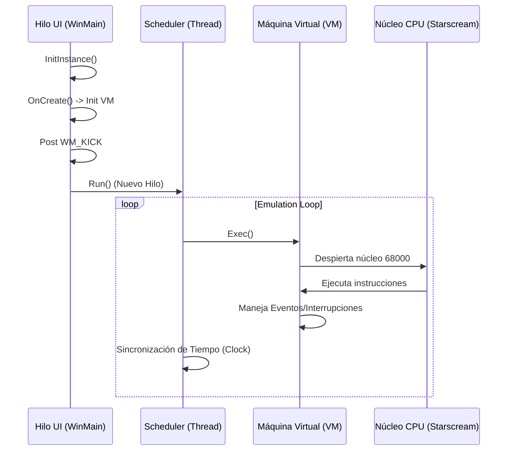

XM6sp
Emulador XM6 2.05 traducido al español y con algunas mejoras.

# Arquitectura y Flujo de Ejecución: XM62022 (XM6sp)

El proyecto XM6sp es un emulador de hardware complejo que utiliza una arquitectura dividida para separar la lógica de la máquina virtual (VM) de la interfaz con el sistema operativo (Win32/MFC).

## Arquitectura de Dos Capas

El sistema se organiza en dos dominios principales:

1.  **Capa VM (Máquina Virtual):**
    *   **Ubicación:** Directorio `vm/`.
    *   **Función:** Es una implementación lógica, agnóstica al sistema operativo, del hardware del Sharp X68000 (CPU 68000, CRTC, DMA, Sonido FM, etc.).
    *   **Estado:** Mantiene el estado interno de la memoria y los registros del hardware emulado.

2.  **Capa MFC (Capa Host):**
    *   **Ubicación:** Directorio `mfc/`.
    *   **Función:** Utiliza el framework MFC de Microsoft para crear la interfaz de usuario en Windows, manejar la entrada de teclado/ratón y renderizar la salida de video/audio de la VM hacia los drivers de Windows.

---

## Flujo de Ejecución Detallado

El flujo desde que se inicia el `.exe` hasta que la emulación está corriendo sigue estos pasos:

### 1. Inicialización (Entry Point)
La aplicación comienza en `CApp::InitInstance` ([mfc_app.cpp](file:///c:/sw/XM62022/mfc/mfc_app.cpp)):
*   Determina las capacidades del procesador host (soporte MMX/CMOV).
*   Configura el entorno (idioma, rutas de configuración).
*   Instancia la ventana principal (`CFrmWnd`).

### 2. Creación del Hardware Virtual
Dentro de `CFrmWnd::OnCreate` ([mfc_frm.cpp](file:///c:/sw/XM62022/mfc/mfc_frm.cpp)):
*   **Instanciación de la VM:** Se crea el objeto global `pVM`.
*   **Carga de Dispositivos:** Se inicializan todos los componentes virtuales (FDC para disquetes, SCSI para discos duros, RTC, etc.).
*   **Puente Host-Guest:** Se vinculan los componentes de MFC (sonido, entrada) con los dispositivos de la VM.

### 3. El Bucle de Emulación (The Heartbeat)
La emulación no corre en el hilo principal de la interfaz de usuario para evitar bloqueos.
*   **`WM_KICK`:** Al finalizar la creación, la ventana envía un mensaje `WM_KICK`.
*   **`CScheduler::Run`:** ([mfc_sch.cpp](file:///c:/sw/XM62022/mfc/mfc_sch.cpp)) Inicia un hilo dedicado que ejecuta el bucle principal.

### 4. Ciclo de Vida de una Instrucción (`vm->Exec()`)
Cada iteración del bucle en `vm.cpp` realiza lo siguiente:
1.  **Fetch & Decode:** El núcleo Starscream lee la siguiente instrucción de la memoria virtual.
2.  **Execute:** El procesador host ejecuta la lógica equivalente a esa instrucción 68000.
3.  **I/O Check:** Si la instrucción accede a una dirección de memoria mapeada a un hardware (ej. `0xE80000` para el CRTC), la VM desvía la llamada al objeto de dispositivo correspondiente.
4.  **Interrupts:** Se verifican si hay interrupciones pendientes (V-Sync, Timers) y se fuerza el salto a la rutina de interrupción si es necesario.

### 5. Renderizado y Salida
*   El hardware de video virtual (`gvram.cpp`, `tvram.cpp`) escribe en buffers internos.
*   El componente `mfc_draw.cpp` toma estos buffers y utiliza GDI/DirectX para dibujarlos en la ventana de Windows en el hilo de la UI.

---

## Resumen de Modulariad
| Módulo | Responsabilidad | Archivo Clave |
| :--- | :--- | :--- |
| **CPU** | Emulación del Motorola 68000 | `cpu.cpp` / `star.c` |
| **Memoria** | Gestión del mapa de memoria del X68000 | `memory.cpp` |
| **Video** | Generación de señales de video y sprites | `render.cpp` / `crtc.cpp` |
| **Disco** | Simulación de unidades de disquete y SCSI | `fdc.cpp` / `scsi.cpp` |
| **Audio** | Síntesis de sonido FM (YM2151) | `opm.cpp` / `adpcm.cpp` |

---

## Profundización en la Capa MFC

La capa de Windows (MFC) no es solo una "carátula", sino un framework de gestión de componentes que envuelve a la VM.

### 1. Arquitectura de Componentes (`CComponent`)
Casi todos los módulos que interactúan con Windows heredan de la clase base `CComponent` ([mfc_com.h](file:///c:/sw/XM62022/mfc/mfc_com.h)).
*   **Encadenamiento:** Los componentes se organizan en una lista doblemente enlazada (`m_pPrev`, `m_pNext`).
*   **Gestión Centralizada:** `CFrmWnd` posee el primer componente y puede buscar cualquier otro mediante `SearchComponent(ID)`.
*   **Ciclo de Vida:** Cada componente tiene sus propios métodos `Init()`, `Cleanup()`, `Save()` y `Load()`, lo que permite que el emulador guarde y restaure el estado de dispositivos específicos (como la configuración del joystick o el volumen).

### 2. Gestión de Menús y Comandos
La interacción del usuario a través de los menús de Windows se gestiona mediante el sistema de **Message Maps** de MFC:
*   **Declaración:** En `mfc_frm.cpp`, se definen los mapeos entre IDs de menú (ej. `IDM_OPEN`) y funciones manejadoras (ej. `OnOpen`).
*   **Lógica de Comandos:** La mayoría de las implementaciones de estos comandos residen en `mfc_cmd.cpp`.
*   **Actualización Dinámica:** Se usan manejadores `ON_UPDATE_COMMAND_UI` para habilitar/deshabilitar opciones de menú en tiempo real (por ejemplo, deshabilitar "Eject" si no hay un disco cargado).

### 3. Sistema de Idiomas e Internacionalización
El emulador gestiona múltiples idiomas (principalmente Japonés y Español/Inglés) de la siguiente manera:

*   **Detección:** En `mfc_app.cpp`, la función `IsJapanese()` determina el idioma del sistema operativo.
*   **Carga de Cadenas (`GetMsg`):** En lugar de usar strings literales en el código, se utiliza la función global `GetMsg(UINT uID, CString& string)`.
    *   Esta función busca el recurso de texto correspondiente al ID en el archivo de recursos (`.rc`).
*   *Archivos de Recursos:*
    *   `mfc_res.rc`: Contiene las definiciones de diálogos, menús y tablas de strings.
    *   `mfc_res.h`: Define las constantes numéricas para cada recurso.
*   **Traducciones:** Al ser esta una versión "sp" (Spanish), muchos de los recursos de texto en el `.rc` han sido modificados para mostrar etiquetas y mensajes en español, manteniendo la compatibilidad con la lógica original mediante los IDs.
