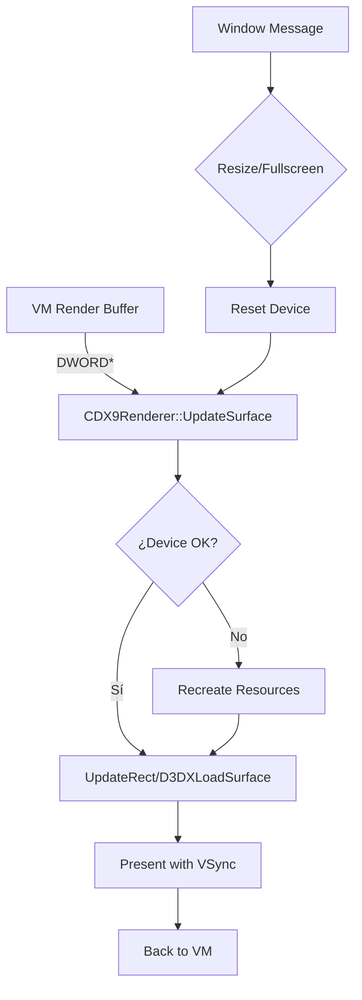

# Plan de Migración de GDI a DirectX 9 con VSync - XM6sp

## Recomendación: DirectX 9 sobre DirectX 8

**Razones para elegir DirectX 9:**

1. **Obsolescencia de DirectX 8** - DirectX 8 ya no es soportado por Microsoft y las APIs modernas
2. **Mejor soporte de hardware** - Las GPUs actuales tienen drivers optimizados para DirectX 9
3. **Funcionalidades superiores** - Texturas comprimidas, mejores shaders, formato de vértices más flexible
4. **VSync robusto** - Direct3D9 Presentation Interval permite control preciso de VSync
5. **Documentación y ejemplos** - Mayor disponibilidad de recursos de desarrollo
6. **Compatibilidad** - Funciona en Windows XP hasta Windows 10/11

---

## Arquitectura Actual vs Nueva

### Sistema Actual (GDI)
```
┌─────────────────────────────────────────┐
│           CDrawView (MFC)               │
│  - HBITMAP + DIB Section                │
│  - BitBlt() / StretchBlt()              │
│  - Renderizado en hilo UI               │
└─────────────────────────────────────────┘
```

### Sistema Nuevo (DirectX 9)
```
┌──────────────────────────────────────────────────────┐
│              CDrawViewModificado (MFC)               │
│  ┌────────────────────────────────────────────────┐  │
│  │         CDX9Renderer (Nueva Clase)            │  │
│  │  - IDirect3D9, IDirect3DDevice9               │  │
│  │  - IDirect3DSurface9 (Backbuffer)             │  │
│  │  - IDirect3DTexture9 (Buffer de video)        │  │
│  │  - Present() con D3DPRESENT_INTERVAL_ONE     │  │
│  └────────────────────────────────────────────────┘  │
└──────────────────────────────────────────────────────┘
```

---

## Pasos de Implementación

### Fase 1: Preparación del Entorno

1. **Agregar encabezados de DirectX 9**
   - Incluir `d3d9.h` y linkeditar `d3d9.lib`
   - Ubicación: Nuevo archivo `mfc/mfc_dx9.h`

2. **Modificar proyecto Visual Studio**
   - Agregar dependencia `d3d9.lib` en linker
   - Actualizar archivos de proyecto: `star.vcxproj`

### Fase 2: Nueva Clase de Renderizado DirectX 9

3. **Crear clase CDX9Renderer** (`mfc/mfc_dx9.cpp/.h`)
   ```cpp
   class CDX9Renderer {
   public:
       // Inicialización
       BOOL Init(HWND hWnd, int width, int height, BOOL bFullscreen);
       void Cleanup();
       
       // Renderizado
       void UpdateSurface(const DWORD* pSrcBuffer, int width, int height);
       void Present();  // Con VSync: D3DPRESENT_INTERVAL_ONE
       
       // Control
       void SetFullscreen(BOOL bFullscreen);
       void Resize(int width, int height);
       
   private:
       IDirect3D9* m_pD3D;
       IDirect3DDevice9* m_pDevice;
       IDirect3DSurface9* m_pBackBuffer;
       IDirect3DTexture9* m_pTexture;
       HWND m_hWnd;
       BOOL m_bFullscreen;
       D3DPRESENT_PARAMETERS m_d3dpp;
   };
   ```

4. **Implementar inicialización de DirectX 9**
   - Crear IDirect3D9 con Direct3DCreate9
   - Configurar D3DPRESENT_PARAMETERS:
     - `Windowed` = !bFullscreen
     - `SwapEffect` = D3DSWAPEFFECT_DISCARD
     - `PresentationInterval` = D3DPRESENT_INTERVAL_ONE (VSync)
     - `BackBufferFormat` = D3DFMT_X8R8G8B8
   - Crear dispositivo con Flags = D3DCREATE_HARDWARE_VERTEXPROCESSING

5. **Implementar renderizado de textura**
   - Crear textura del tamaño del buffer de video (ej: 1024x1024)
   - Usar UpdateRect/D3DXLoadSurfaceFromMemory para copiar datos
   - Renderizar textura a pantalla completa (Fullscreen Quad)

### Fase 3: Integración con Sistema Existente

6. **Modificar CDrawView** (`mfc/mfc_draw.cpp/.h`)
   - Agregar puntero a CDX9Renderer
   - Modificar método `Draw()` para usar renderer activo
   - Mantener compatibilidad hacia atrás con GDI (opcional)

7. **Adaptar flujo de renderizado**
   - En `OnDraw()` o `Draw()`: actualizar superficie DirectX
   - Llamar `Present()` después de actualizar buffer
   - Manejar mensajes de pérdida de dispositivo (D3DERR_DEVICELOST)

### Fase 4: Configuración y Opciones de Usuario

8. **Agregar opciones a configuración** (`vm/config.h`)
   ```cpp
   // En clase Config
   int renderer_type;        // 0=GDI, 1=DirectX9
   BOOL vsync_enabled;       // Habilitar/deshabilitar VSync
   ```

9. **Crear diálogo de opciones de video**
   - Selector de motor de renderizado (GDI/DirectX 9)
   - Checkbox para VSync
   - Selector de modo de pantalla (Ventana/Fullscreen)

10. **Guardar/cargar configuración**
    - Persistir opciones en archivo de configuración

### Fase 5: Soporte Fullscreen

**IMPORTANTE: Fullscreen No Exclusivo (Borderless Windowed)**
Este modo redimensiona la ventana para ocupar toda la pantalla sin cambiar la resolución del escritorio ni usar el modo exclusivo de DirectX.

**Ventajas:**
- No requiere cambiar la resolución del escritorio
- Mantiene la tarea de Windows visible
- Transición instantánea (sin parpadeo)
- Más compatible con múltiples monitores
- VSync funciona correctamente

11. **Implementar transición ventana ↔ fullscreen**
    - En `CDX9Renderer::SetFullscreen(BOOL bFullscreen)`:
      - Si `bFullscreen == TRUE`:
        - Obtener dimensiones del monitor con `GetMonitorInfo()` o `EnumDisplayMonitors()`
        - Usar `SetWindowLongPtr(GWL_STYLE, 0)` para quitar bordes
        - Usar `SetWindowPos()` con SWP_FRAMECHANGED para quitar barra de título
        - Mover ventana a posición (0,0) del monitor
        - Establecer tamaño al del escritorio (ancho x alto)
        - IMPORTANTE: `Windowed = TRUE` se mantiene (es modo ventana redimensionado)
        - Recrear D3DPRESENT_PARAMETERS para nueva resolución de backbuffer
        - Llamar `Reset()` al dispositivo
      - Si `bFullscreen == FALSE`:
        - Restaurar estilo de ventana original
        - Restaurar posición y tamaño original
        - Resetear dispositivo a resolución original

12. **Manejar teclas de acceso rápido**
    - Alt+Enter para alternar fullscreen
    - Escape para salir de fullscreen

### Fase 6: Manejo de Estados de Dispositivo

13. **Implementar recuperación de dispositivo perdido**
    - Detectar D3DERR_DEVICELOST
    - Liberar recursos (texturas, surfaces)
    - Recrear cuando D3DERR_DEVICENOTRESET

14. **Sincronización con hilo de emulación**
    - El renderer debe ser thread-safe
    - Usar mutex para proteger acceso a recursos DirectX

---

## Consideraciones de Implementación

### Buffer de Video
- Resolución típica del X68000: 512x512 a 1024x1024
- Usar textura 1024x1024 o 2048x2048 para flexibilidad
- Formato de píxeles: D3DFMT_A8R8G8B8 (32-bit RGBA)

### Rendimiento
- Usar D3DPOOL_DEFAULT para texturas que cambian frecuentemente
- Considerar D3DPOOL_MANAGED para texturas estáticas
- Usar StretchRect para copiar a backbuffer

### Formato de Presentación

**VSync**
- **Habilitado:** `PresentationInterval = D3DPRESENT_INTERVAL_ONE`
- **Deshabilitado:** `PresentationInterval = D3DPRESENT_INTERVAL_IMMEDIATE`

**Nota:** El modo no exclusivo permite VSync sin problemas de compatibilidad.

---

## Archivos a Modificar/Crear

| Archivo | Acción | Descripción |
|---------|--------|-------------|
| `mfc/mfc_dx9.h` | Crear | Encabezados de clase DirectX 9 |
| `mfc/mfc_dx9.cpp` | Crear | Implementación del renderer |
| `mfc/mfc_draw.h` | Modificar | Agregar puntero a CDX9Renderer |
| `mfc/mfc_draw.cpp` | Modificar | Integrar renderizado DirectX |
| `vm/config.h` | Modificar | Agregar opciones de renderer |
| `mfc/mfc_cfg.cpp` | Modificar | Opciones de UI para renderer |
| `star.vcxproj` | Modificar | Agregar d3d9.lib |

---

## Diagrama de Flujo de Renderizado



---

## Recomendaciones Finales

1. **Mantenerse compatible con GDI** inicialmente, permitir al usuario seleccionar
2. **Probar en múltiples configuraciones** de hardware
3. **Manejar gracefulmente** la ausencia de DirectX 9 (fallback a GDI)
4. **Testing exhaustivo** de transiciones ventana/fullscreen
5. **Verificar** que VSync funciona correctamente en diferentes tasas de refresco
